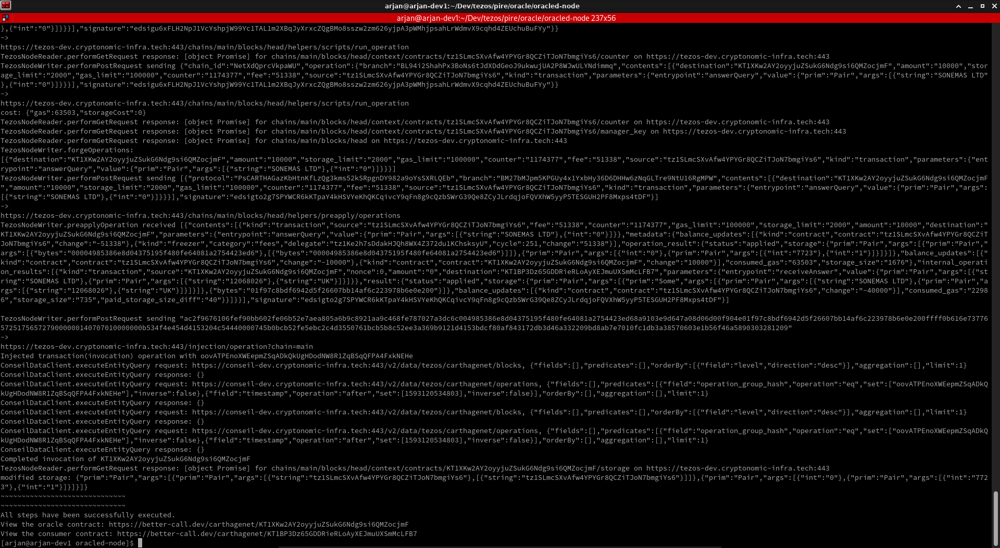
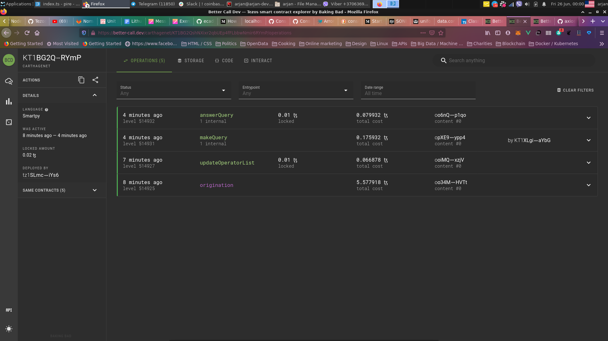
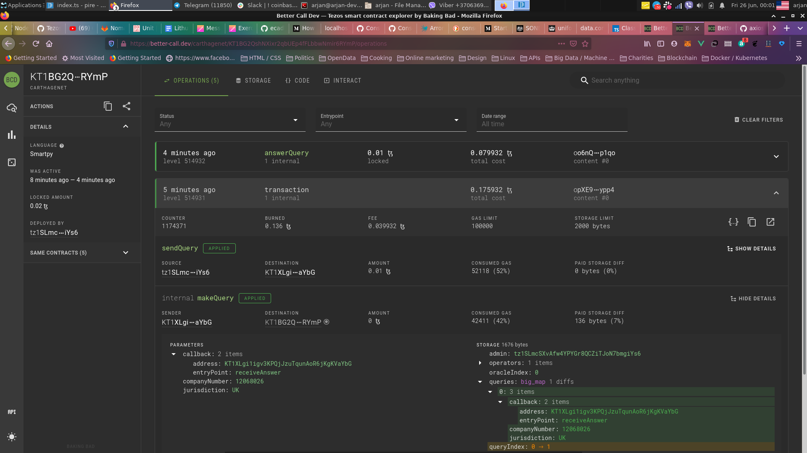
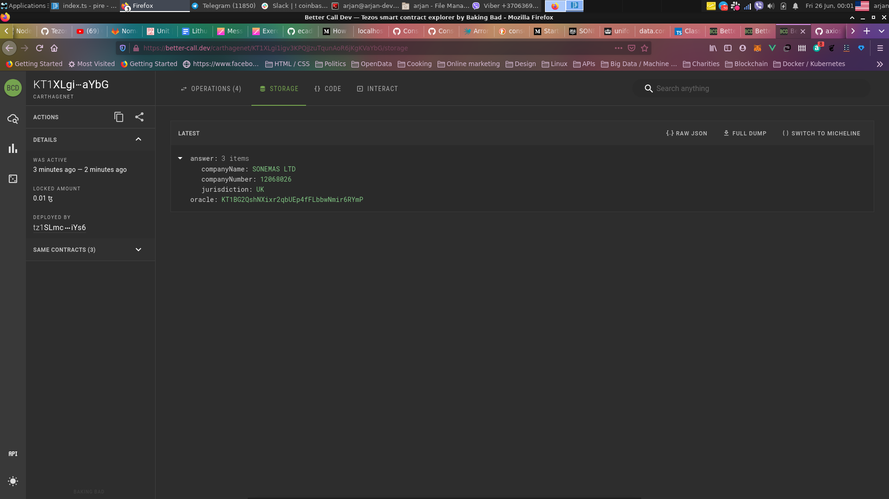

# Public Infrastructure Redefined

The project has the goal to make business data available on and via blockchain in combination with self-sovereign identity for businesses and their related persons.

One part of the project is making business data available on blockchain through oracles.

## Start of the project

The project had its kickoff at the Coinlist Tezos hackathon from the 25th of May - the 25th of June, because Tezos is a blockchain we strongly believe in and an ecosystem which could benefit of integration with existing business data points.

### Hackathon submission

A very simple version of a business data oracle has been created for the hackathon. This submission is very far from being production ready.

#### Using the hackathon submission

Go to the /oracle/oracled-node directory

1. Download a json file from the Tezos faucet
2. Run `npm intall`
3. Run `npm run`

This will execute the following steps:
- Activate and reveil the faucet address
- Deploy the oracle contract
- Deploy the consumer contract
- Update the oracle operator list
- Send a query from the consumer contract to the oracle for a UK company with company number 12068026.
- Answer the query via the oracle contract, by getting the data, in this case only the company name, via the UK trade register.

4. Navigate to the provided links to view both contracts and how the oracle has answered the query. The answer is stored in the consumer contract.

#### Smart contracts

The smart contracts can be found in the `contract/tezos` directory.

## Getting the oracle production ready

- The oracle currently uses the simplified interface of the UK trade register. We have already developed a Go SDK for the extended API service of Companies House, but unfortunately the Tezos SDK for Go isn't production ready, so we couldn't use our library and offer a much wider range of company data, including officers and filings within the timeframe of the hackathon;
- Support for more jurisdiction than just the UK;
- The current version is made with nodejs and conseiljs. However we had severe problems using conseiljs. Elementry tasks, like getting a map from the storage is way too complicated with conseiljs, which significantly decreases productivity. 

For this reason the demo isn't very interactive and answering to oracle queries has been hard coded into the demo. Normally the oracle would observe the map for query requests and answer them. Due to the deadline and the problems using maps via conseiljs there was no time left to implement this.